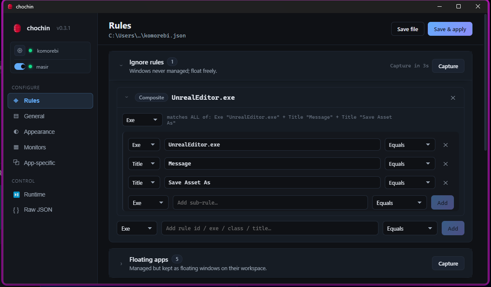

#  chochin


A modern GUI for managing the [komorebi](https://github.com/LGUG2Z/komorebi) window manager on Windows:
rules, general config, monitors & workspaces, app-specific config, live runtime controls, and a raw
JSON editor.

> Built on komorebi. Rule semantics, config paths and the `komorebic` CLI are komorebi's own.
>
> **v0.3.1** — release builds live in `release/`: `chochin 0.3.1.exe` (portable) and
> `chochin Setup 0.3.1.exe` (installer).



## ✨ What can it do?

- 📸 **Capture any window** — click **Capture**, focus the window you want, and 5 seconds later
  chochin has snapshotted its `exe` + `title` and built a matching rule for you
- 🎯 **Rules that actually target the right window** — each captured rule matches *one exact
  window* (like Unreal's "Message Log" dialog) while the main app stays neatly tiled
- 🪟 **Nine rule sections, all capturable** — float, ignore, force-manage, workspace, transparency,
  tray/multi-window, layered, name-change and slow apps — every section has its own Capture button
- 🧱 **Readable rule blocks** — every rule gets its own card titled by the exe name, with sub-rules
  nested underneath
- ⚙️ **General config** — gaps, padding, focus behaviour and the rest of komorebi's knobs, without
  hand-editing JSON
- 🎨 **Appearance** — colours, themes, borders, and global container/workspace padding defaults
- 🖥️ **Monitors & workspaces** — per-monitor workspaces with per-workspace layout and padding
- 📱 **App-specific overrides** — edit `applications.json` from the same UI
- 🚀 **Runtime controls** — pause, retile, float, switch layouts and focus workspaces live, plus a
  komorebi output log
- 🔌 **masir in one click** — start/stop the focus-follows-mouse replacement straight from the
  sidebar, next to the live komorebi status dot
- 🧹 **Deprecated/EOL field control** — amber *deprecated* and red *EOL* tags with toggles to hide
  what you don't use, and auto-migration of legacy config forms
- ✅ **Save & apply** — validates with `komorebic check`, then restarts komorebi so window rules
  take effect immediately

## Requirements

- [komorebi](https://komorebi.org/) installed and running
- A `komorebi.json` and optional `applications.json` (komorebi's standard config files)

## Compatibility

Built and tested against the **komorebi 0.1.41** config schema. The config format changed
significantly between versions; chochin reads and writes the 0.1.4x format.

Key changes vs. older komorebi configs:

- `border` is now a **boolean** (on/off). Window *colours* moved to `border_colours`
  (`single` / `stack` / `monocle` / `floating` / `unfocused` / `unfocused_locked`).
  chochin maps an "Active colour" onto all focused states and "Inactive colour" onto
  the unfocused states, and **auto-migrates** the legacy object form
  (`active_colour` / `inactive_colour`) when you load an old config. Colours in
  `border_colours` are ignored while a `theme` is defined.
- **End of life:** `focus_follows_mouse` (use [masir](https://github.com/LGUG2Z/masir) instead).
- **Deprecated / deprecated in 0.1.4x:** `border_style`, `border_z_order`,
  `invisible_borders`, `minimum_window_width`, `minimum_window_height`,
  `custom_layout` / `custom_layout_rules`.

Deprecated and end-of-life fields are tagged inline in the UI (amber **deprecated**,
red **EOL**). The **General → Option visibility** toggles let you show or hide both
groups; the FFM (EOL) and deprecated-appearance options fade out of the editors, while
familiarly the EOL group stays visible by default because it still works.

## How it finds your files

chochin never hardcodes a username or machine path. On startup it resolves, in order:

| What           | Resolution order                                                            |
| -------------- | --------------------------------------------------------------------------- |
| `komorebi.json` | `%USERPROFILE%\komorebi.json` (komorebi's default), unless overridden       |
| `applications.json` | Next to your `komorebi.json`, else `%USERPROFILE%\applications.json`    |
| `komorebic.exe` | `C:\Program Files\komorebi\bin`, Program Files (x86), WinGet Links, Scoop, or `PATH` |

If your files live somewhere else, click **Locate komorebi.json…** / **Locate komorebic.exe…** in
the sidebar. Your choices are remembered in `%APPDATA%\chochin\settings.json` and reused on next
launch.

## Using it

- **Rules** — add/remove ignore, floating, force-manage, workspace, transparency and more rules by
  kind (`Exe`/`Class`/`Title`/`Path`) and strategy (`Equals`/`Contains`/`Regex`/`Legacy`).
  Every rule section has a **Capture** button: focus the window you care about, and chochin adds a
  *composite* rule matching that window's `Exe` **and** `Title` (both must match) to the section —
  perfect for dialogs like Unreal's "Message Log" while the main editor stays managed. Each rule
  renders as its own block titled by its primary id (the exe name for composites), and composite
  rules serialise to komorebi's array form automatically. Note komorebi composites are **AND**:
  to float any of several titles of the same app, use one rule per title (the top-level list is
  OR).
- **General** — core behaviour, plus toggles to show/hide deprecated and end-of-life options.
- **Appearance** — colours, theme, borders, and the **global defaults** for container (gap between
  windows) and workspace (screen-edge) padding, plus the global work-area offset.
- **Monitors** — per-monitor workspaces with per-workspace layout and padding overrides.
- **App-specific** — per-application overrides for `applications.json`.
- **Runtime** — live state KPIs, controls (pause, float, retile), layout switching and workspace
  focus, plus a **Komorebi output** log card at the bottom showing the last komorebi command's
  output (persisted across restarts).
- **Raw JSON** — full-file editor; everything the forms don't cover.
- **Sidebar** — live komorebi connection status, plus a **masir** toggle (start/stop the
  focus-follows-mouse replacement in one click) when masir is detected on the machine.
- **Save file** writes the config (keeping a `.bak`). **Save & apply** validates the file with
  `komorebic check`, then **restarts komorebi** (`stop` → `start`) so the configuration — including
  window rules — actually takes effect. Any windows already open during a restart drop out of
  management until they're re-focused and managed again.

## Development

```bash
npm install        # first time
npm run dev        # hot-reload dev (vite + electron)
npm run build      # typecheck + build renderer into dist-renderer/
npm start          # run the built app
npm run dist       # package installer + portable exe into release/
```

## Layout

```
electron/    main process, IPC, komorebic wrapper, path resolution, settings store
renderer/    React + Vite UI (sidebar, forms, runtime panel)
build/       app icon (icon.png / icon.ico)
schema.json  komorebi schema (reference for the editor)
```

## License

MIT. `schema.json` / `schema.asc.json` are copied from
[LGUG2Z/komorebi](https://github.com/LGUG2Z/komorebi) (MIT) for editor reference.
